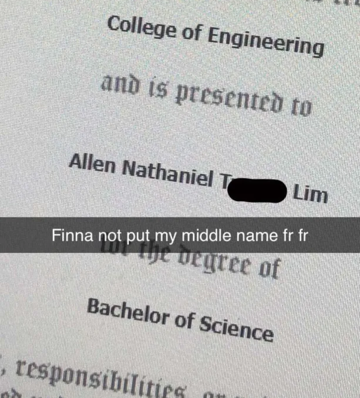

# OvercomplicatingNames

Repo to hopefully guess my friends middle name

### Context:

My friend and I have had an inside joke in which I would never learn his middle name and he would do everything in his power to stop me from learning it. Then in Spring 2023, he sent me a picture

So I told him "You done messed up, you gave me a breadcrumb!", and I started typing these scripts out.

Update Result: In my top ten list, the name he put was #2, so I got close, but not it. Turns out my friend also somehow KNEW I WOULD DO THIS, and typed a different name into his diploma preview.

Here I'll also list the resulting things, please keep in mind the presentation was made to entertain an audience of like 21-24 year olds, so dont be too hard on my language lol.

I'd view this in presentation mode with Presenter View for max context if for some reason you decide to view it.

[Presentation](https://docs.google.com/presentation/d/1PfUnKT2nUD-XX1da70M4cepH4l5bzYRxNbNDa0rvc7w/edit?usp=sharing)

[Selenium Script Run](https://youtu.be/4K4YVkAV1Fo?si=1c7McHHyaXm-RPP5)
