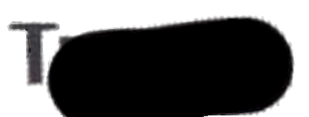

This is a [Next.js](https://nextjs.org/) project bootstrapped with [`create-next-app`](https://github.com/vercel/next.js/tree/canary/packages/create-next-app).

## Getting Started

Just a quick app to display my friends name and automate screenshots with selenium

Heres the images I displayed to then overlay and screenshot, you can take a look at the [youtube video](https://youtu.be/4K4YVkAV1Fo?si=1c7McHHyaXm-RPP5) for a quick glance

    
    

